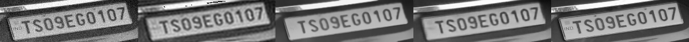
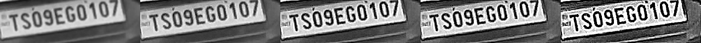
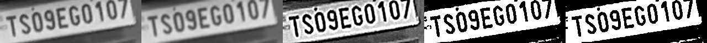
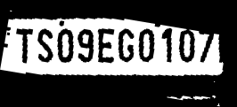
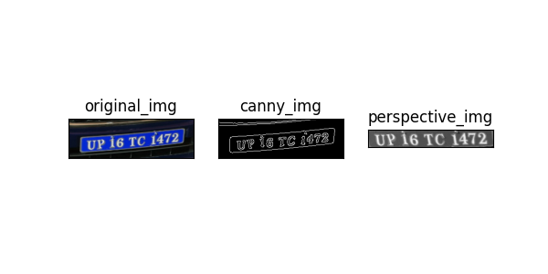

# NPR
Number Plate Recognition


We designed a pipeline consisting **6 stages followed by OCR**,
```
            ----------------------------------------------------------------------------------------------------------------------
           |                                                                                                                      |
raw_img -> | img_enhancement -> selective_denoising -> selective_deblurring -> thresholding -> morph_transform -> text_alignment  | -> processed_img -> OCR
           |                                                                                                                      |
            ----------------------------------------------------------------------------------------------------------------------
```

**1. Image Enhancement -** Stage1 improves the quality of image. For this we used SRCNN. Currently it is not performing well. `SRCNN` is a deep convolutional neural network that learns end-to-end mapping of low resolution to high resolution images.  As a result, we can use it to improve the image quality of low resolution images.  To evaluate the performance of this network, we will be using three image quality metrics: peak signal to noise ratio (PSNR), mean squared error (MSE), and the structural similarity (SSIM) index.

**2. Selctive Denoising -** Stage2 denoises images that have significant amount of noise, all images that don't have a minimum noise threshold are passed as it is. The reason for this `selective denoising strategy` is that if the image is already very clear then avoiding denoiser not only saves from computation but also prevents from blurring the image (as Autoencoder blurs the image while denoising). If noise is below the threshold value then we simply apply gaussian blur to remove artificats if any. To calculate the noise level in an image `estimate_sigma` function is used from `skimage.restoration` API.

For denoising I explored many ways including training an Autoencode from scratch, below is the comparison of all different ways explored,

**img_noisy | img_denoised_fft | img_denoised_NLMeans | img_denoised_AE  | img_orig** 


On average I found that `AE` performs well whereas `NLMeans` denoising capabilities are almost same as `AE`. But `NLMeans` is faster than `AE`.

**3. Selctive Deblurring -** Stage3 deblurs images that have significant amount of blur, all images that don't have a significant amount of blur are passed as it is. The reason for this `selective deblurring strategy` is that if the image is already very clear then avoiding deblurring saves from redundant computation.To calculate the blur level we calculate `variance of Laplacian` of the image and compare that with a suitable threshold.

For deblurring I tried many ways including deblurring using custom kernels, below is the comparison of all different ways explored,

**img | sharpen_kernel_1 | sharpen_kernel_2 | custom_kernel_1 | custom_kernel_2**


**4. Thresholding -** Stage4 thresholds the image using `THRESH_BINARY + THRESH_OTSU`.

**5. Morphological_Transform -** Stage5 applies a `MORPH_CLOSE` transform i.e., `dilation followed by erosion`.

**6. Text Alignment -** Stage6 aligns the text in number plate horizontally.

Below is an sample image showing how the image is transformed by our pipeline at each step, 

**input_image  -->  denoised_img  --> deblured_img  -->  threshed_img  -->  morphed_img  --> aligned_img**



**6. OCR -** After the image is processed by this pipeline, it is than passed to an OCR model, currently we have explored `pytesseract` which is terrible for this task and `keras_ocr` which is better atleast in text detection but requires improvement for text recognition.

Apart from this we have also explored one more stage for our pipeline `perspective transform` after stage5 and before OCR. After this transformation the image looks like below,


But currently we are not able to detect all the 4 corners of the number plate, hence for now this stage is excluded from this pipeline.
